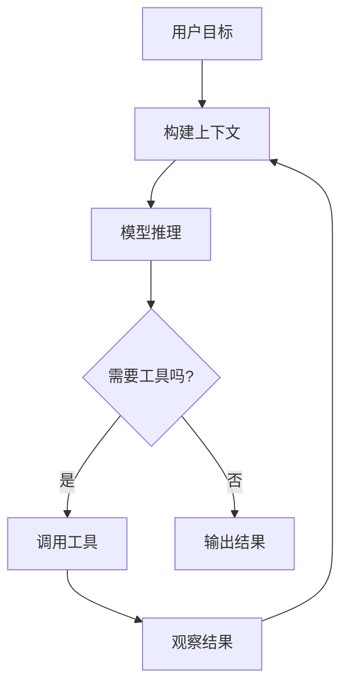
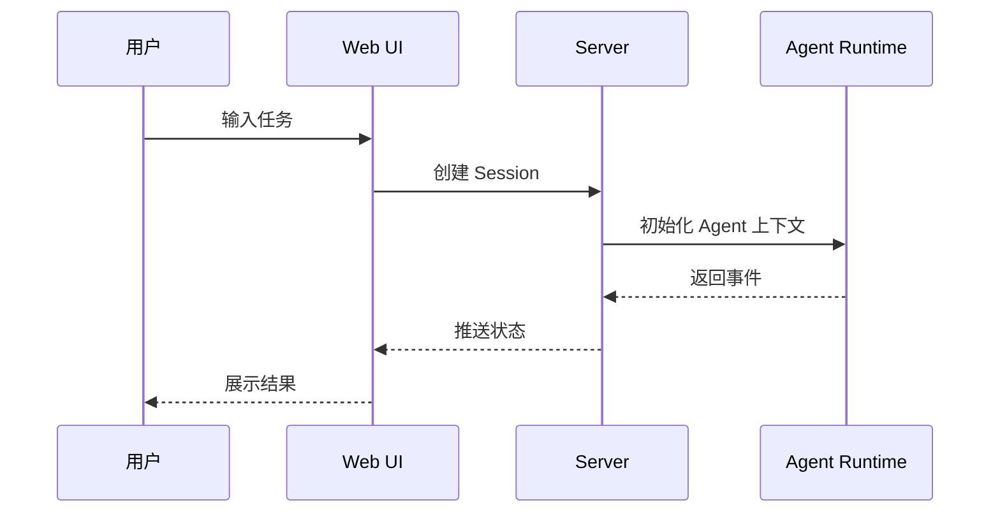

# 知识教学博客模板

> 用途：每个阶段的博客草稿。它不是技术设计文档，而是一篇面向读者的知识教学文章。

```md
# 标题：从 <核心概念> 理解 Web AI Coding Agent 的 <阶段主题>

## 开篇：为什么需要这个能力

用一个具体问题开场。

示例：

当我们说“让 Agent 修代码”时，真正困难的地方并不是让模型生成一段代码，而是让它知道：

- 应该读哪些文件；
- 什么时候调用工具；
- 如何观察工具返回结果；
- 什么时候继续执行；
- 什么时候停止并交还结果。

这就是本章要解释的核心概念：<核心概念>。

## 本章你会学到什么

读完本文，你应该能理解：

1. <学习目标 1>
2. <学习目标 2>
3. <学习目标 3>

## 一、核心概念：<概念名称>

先用自然语言解释概念，不要直接进入代码。

应该回答：

- 它是什么？
- 它解决什么问题？
- Web AI Coding Agent 为什么需要它？
- 它和普通聊天机器人有什么区别？

## 二、先用图理解它

插入至少一张概念图。



图后必须解释：

这张图表达的是：<解释流程>。

当前阶段代码主要实现其中的：<当前实现部分>。

尚未实现的是：<未实现部分>。

## 三、当前阶段实现了什么

说明本阶段新增或修改了哪些能力。

不要只列文件，要解释能力。

示例：

本阶段并没有实现完整的 Agent，而是先实现了 Web AI Coding Agent 的交互骨架：

- Web 端可以展示基础布局；
- Server 端可以创建 session；
- 前后端共享 session 类型；
- 后续 Agent 事件可以沿着这条通道传递。

## 四、代码走读

### 4.1 <文件或模块名称>

`<真实代码路径>`

```ts
// 粘贴短代码片段，不要整文件粘贴
```

这段代码的关键点是：<解释>。

它和本章概念的关系是：<解释>。

### 4.2 <文件或模块名称>

`<真实代码路径>`

```ts
// 粘贴短代码片段
```

这段代码解决了：<解释>。

## 五、实现流程图

插入流程图、时序图、架构图或状态机图。



解释这个流程：

1. 第一步发生了什么；
2. 第二步为什么需要；
3. 当前阶段实现到哪里；
4. 下一阶段会补齐什么。

## 六、效果展示

展示当前阶段实际效果。不要伪造。

可选内容：

### Web UI

```md

```

如果没有截图：

> 当前阶段还没有可截图的 UI 效果。这里先使用流程图展示交互关系，后续阶段完成 UI 后会补充截图。

### API 响应

```json
{
  "sessionId": "demo-session",
  "status": "created"
}
```

### 终端验证输出

```bash
npm run typecheck
npm run build
```

```text
粘贴真实输出摘要
```

### Agent Trace / Diff Preview

```text
粘贴真实 trace 或 diff 摘要
```

## 七、设计取舍

说明本阶段为什么这样做。

示例：

我们没有在这一阶段直接实现完整 Agent Loop，而是先把 Web、Server 和 Shared Types 分开。这样做的好处是：

1. UI 不会和 Agent 内核耦合；
2. 后续 CLI 或 VS Code 插件也可以复用 Agent Runtime；
3. 教程读者能先理解系统边界，再进入 Agent Loop。

## 八、当前局限

必须明确说明当前还没有实现什么。

示例：

当前阶段还没有实现：

- 文件系统工具；
- 模型调用；
- Agent Loop；
- Patch 编辑；
- Shell 执行；
- LSP Diagnostics。

## 九、本章小结

总结本章学到的概念和实现结果。

## 十、下一章预告

下一章将进入：<下一阶段主题>。

我们会实现：<下一阶段能力>。
```
