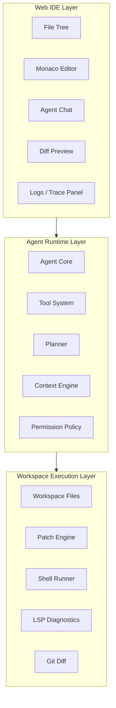

# Mermaid 架构图模板

图后解释：

这张图展示了三层边界。

- Web IDE Layer 只负责交互和展示；
- Agent Runtime Layer 负责 Agent 的推理循环、工具调度、上下文和规划；
- Workspace Execution Layer 负责真实的文件、命令、补丁、诊断和 Git 信息。

当前阶段代码应该明确属于其中一层，不能把 Agent 内核逻辑写进 Web 页面。
