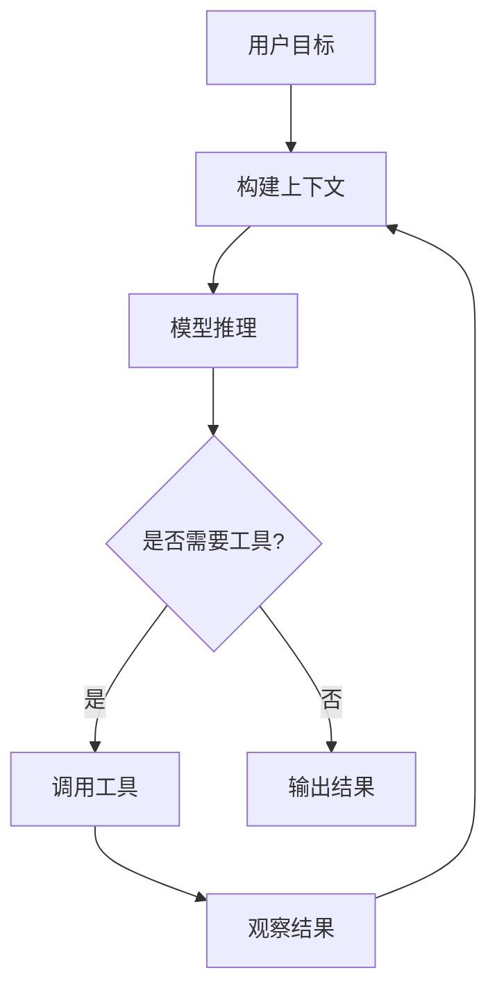

# Mermaid 流程图模板

```mermaid
flowchart TD
    A[用户目标] --> B[构建上下文]
    B --> C[模型推理]
    C --> D{是否需要工具?}
    D -->|是| E[调用工具]
    E --> F[观察结果]
    F --> B
    D -->|否| G[输出结果]
```

图后解释：

这张图表达的是 <概念名称> 的基本流程。

1. 用户目标触发流程；
2. 系统先构建上下文；
3. 模型根据上下文决定是否调用工具；
4. 工具结果会作为 Observation 回到 Agent；
5. 如果不再需要工具，Agent 输出最终结果。

当前阶段实现的是：<当前实现部分>。

还没有实现的是：<未实现部分>。
