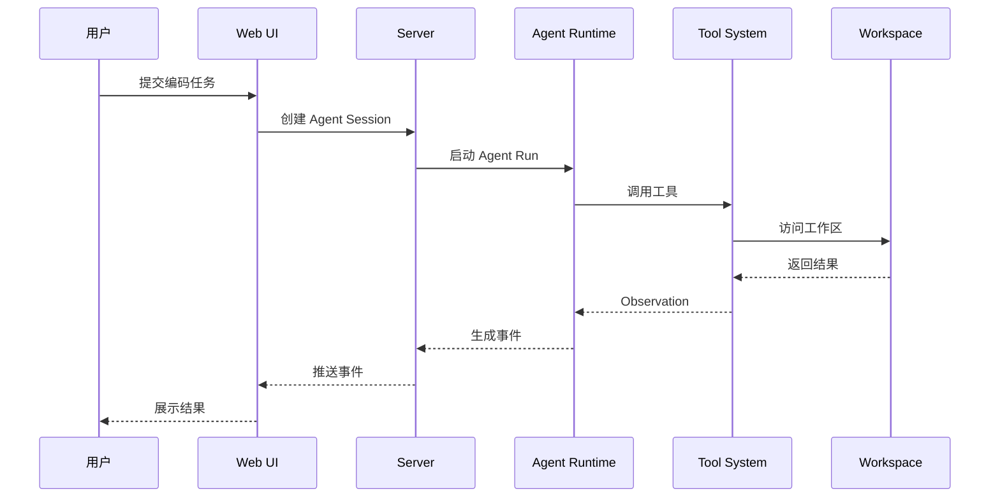

# Mermaid 时序图模板

图后解释：

这张时序图展示了 Web AI Coding Agent 的一次交互。

重点说明：

1. Web UI 不直接执行工具；
2. Server 负责承接会话和事件；
3. Agent Runtime 负责推理和调度工具；
4. Workspace 层负责真实文件、命令、诊断等执行能力；
5. Observation 会回到 Agent，形成下一轮判断。
