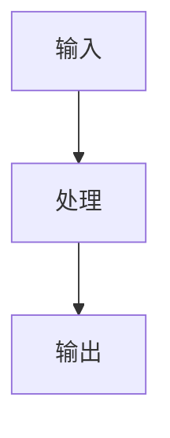

# 教程章节模板

> 用途：每个阶段的教程章节。教程比博客更偏步骤化，但仍然要解释概念和图示。

```md
# 第 <N> 章：<章节标题>

## 学习目标

本章结束后，你应该能够：

1. 理解 <概念 1>；
2. 解释它在 Web AI Coding Agent 中的作用；
3. 阅读并运行本阶段代码；
4. 观察本阶段效果。

## 前置条件

你需要：

- Node.js / pnpm / npm 环境；
- 已完成前一阶段；
- 已阅读 `docs/ARCHITECTURE.md`；
- 了解基本 TypeScript。

## 本章要构建什么

本章会实现：

- <能力 1>
- <能力 2>
- <能力 3>

不会实现：

- <明确不做 1>
- <明确不做 2>

## 概念解释

解释本章核心概念。

## 图示理解

插入至少一张图。



解释这张图。

## 实现步骤

### 步骤 1：创建/修改 <模块>

涉及文件：

- `<路径 1>`
- `<路径 2>`

解释为什么要这样组织。

### 步骤 2：实现核心类型或接口

```ts
// 短代码片段
```

解释代码。

### 步骤 3：串联流程

```ts
// 短代码片段
```

解释代码。

## 运行与验证

运行：

```bash
<验证命令>
```

真实输出摘要：

```text
<粘贴真实输出>
```

如果验证失败，说明如何排查。

## 效果展示

展示当前阶段效果。

- Web UI 截图；
- API 响应；
- 日志；
- Trace；
- Diff；
- 验证输出。

## 常见错误

### 错误 1：<错误名称>

原因：

解决：

### 错误 2：<错误名称>

原因：

解决：

## 当前局限

当前还没有实现：

- <局限 1>
- <局限 2>

## 下一章

下一章会实现：<下一阶段能力>。
```
