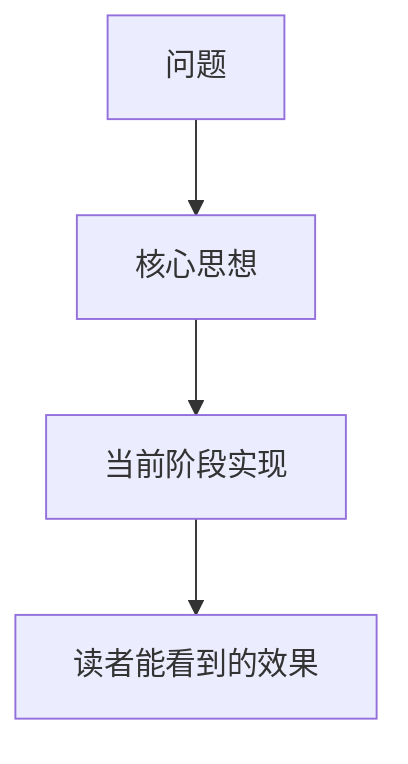
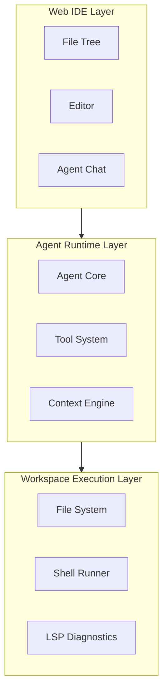
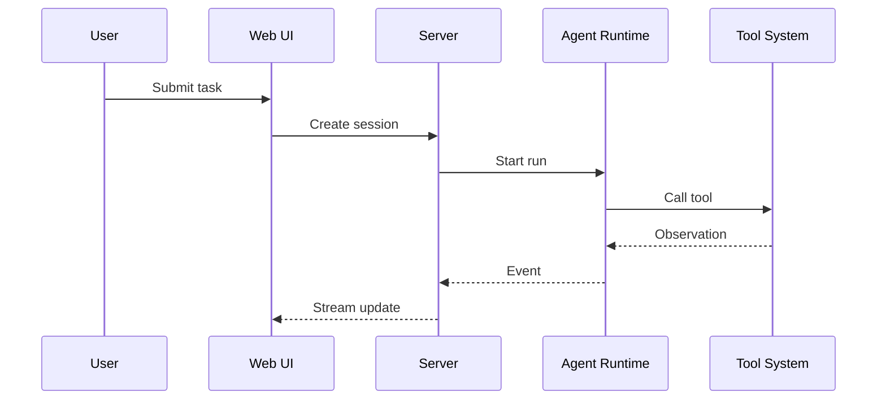
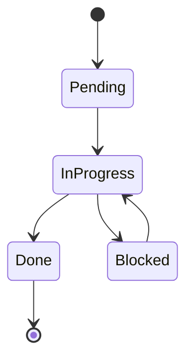

# 图示解释模板

> 用途：在知识教学博客中用图片和图示帮助读者理解。

## 图示原则

图示的目标不是装饰，而是降低理解成本。

一张好图应该回答一个明确问题：

- Agent Loop 是如何循环的？
- Web UI、Server、Agent Runtime 如何交互？
- Tool Call 的输入输出如何流动？
- Patch 是如何从提议到应用的？
- 权限系统如何决定是否允许命令执行？
- LSP Diagnostics 如何反馈给 Agent？
- Trace 如何记录一次 Agent Run？

## 每篇博客至少包含

1. 一张概念图；
2. 一张流程图 / 时序图 / 架构图 / 状态机图；
3. 一个效果展示图或效果输出。

## 推荐图示类型

### 1. 概念图

用于解释一个抽象概念。



### 2. 架构图

用于解释模块分层。



### 3. 时序图

用于解释交互过程。



### 4. 状态机图

用于解释任务状态、Todo 状态、审批状态。



### 5. 效果截图

用于展示真实页面或运行结果。

```md

```

如果截图暂时没有：

```md
> 截图 TODO：当前阶段完成 UI 后补充 `docs/blog/assets/phase-XX/diff-preview.png`。
```

## 图后解释模板

每张图后都必须写解释：

```md
这张图可以分成三部分理解：

1. <第一部分>：说明...
2. <第二部分>：说明...
3. <第三部分>：说明...

当前阶段实现的是图中的 <部分名称>。
暂时没有实现的是 <部分名称>。
```

## 图片资源目录

图片资源保存到：

`docs/blog/assets/phase-XX/`

命名示例：

- `concept-agent-loop.svg`
- `architecture-web-runtime-workspace.svg`
- `sequence-tool-call.svg`
- `state-todo-planner.svg`
- `effect-web-ui.png`
- `effect-validation-output.png`

## 精确性规则

- 精确架构图优先用 Mermaid 或 SVG；
- 不要用 AI 生成图表达精确模块关系；
- AI 生成图只适合封面、banner、抽象概念插画；
- 截图必须来自真实运行效果；
- 命令输出必须来自真实命令。
