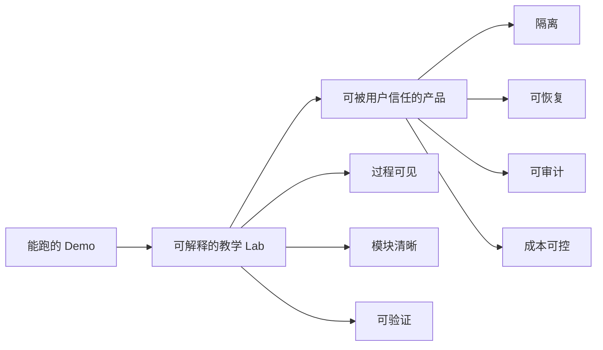
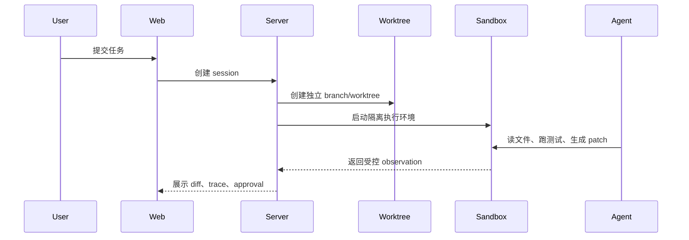

# 从 Web AI Coding Agent Lab 到产品，还差哪一步

一个 Coding Agent 能跑起来，不等于它能被用户放心使用。

教学项目最容易让人产生错觉：页面上有 Agent Chat，模型能调用工具，能生成 Patch，也能跑命令，好像已经是一个产品了。但真正的产品问题通常不在“模型会不会回答”，而在“它出错时会不会破坏用户代码、泄漏密钥、烧光预算、留下无法审计的状态”。

Phase 19 的主题就是这件事：从教学 Lab 走向工程产品。

## Lab 和产品的区别



Web AI Coding Agent Lab 现在已经接近中间状态：它能解释 Tool System、Agent Loop、Patch、Approval、Shell、Trace、Eval 和 Subagents。

但产品还需要更硬的边界。

## 第一件事：清理历史包

Phase 19 删除了两个历史原型包：

- `packages/agent`
- `packages/db`

`packages/agent` 曾经把 DeepSeek client、tool loop、workspace 和 diff 放在一个包里。这个设计适合快速 demo，但不适合教学型分层架构。现在这些职责已经拆到 `agent-core`、`model-provider`、`tool-system`、`workspace` 和 `patch-engine`。

`packages/db` 是早期 SQLite 原型。当前项目的 session、trace、approval、command、repair 和 eval 记录由 `telemetry` 包管理。未来确实需要数据库，但应该从当前领域模型迁移，而不是回到早期 game/course 原型表。

清理不是为了让目录更少，而是为了让架构没有两套答案。

## Memory：现在是记录，不是记忆

当前项目已经有短期工作记忆：

- Agent Run 内的 messages。
- 工具 observation。
- Context Engine 生成的 context summary。

也有长期记录：

- session log。
- trace timeline。
- model call。
- command history。
- patch history。

但这些还不是产品级 memory。

产品里的 memory 至少要分层：

```text
conversation memory：用户这次对话想要什么
run memory：当前任务做到哪一步
workspace memory：项目结构、最近修改、失败命令
project memory：长期事实和约定
user memory：偏好、风格、禁用动作
```

当前项目做到了“可复盘”，还没做到“可检索、可恢复、可跨任务使用”。

## Tool System：已经可教学，还需治理

现在的 Tool System 已经有核心骨架：

- 工具注册。
- schema validation。
- permission class。
- hooks before/after。
- trace。

这足够讲清楚“模型不能直接操作世界，必须通过结构化工具”。

但产品还需要：

- 工具版本。
- 工具来源。
- 每个 workspace 的工具策略。
- MCP server 的权限审核。
- 动态审批规则。

工具越多，风险不是线性增加，而是组合增加。MCP 和插件系统必须接入权限、审计和成本控制，而不是直接暴露给模型。

## Context：不是越多越好

Phase 12 的 Context Engine 已经做了正确的第一步：repo map、diagnostics、relevant files、budget、observation compression。

这比“把整个仓库塞进 prompt”更接近真实系统。

下一步不是简单扩大 context window，而是让上下文更有结构：

- 当前错误对应的代码片段。
- 最近 git diff。
- 最近失败命令。
- LSP symbol。
- 用户刚批准或拒绝的 patch。
- 子任务计划和未完成状态。

好的 Context Engine 不是仓库打包器，而是任务相关性排序器。

## Skill：从提示词片段到工作流资产

当前 Skills 能从 `.skills` 读取 `SKILL.md`，根据 triggers 选择一个 skill，并把选择写进 trace。

这已经说明了一个关键点：工作流 prompt 不应该散落在代码里。

但产品化 skill 还需要：

- 版本。
- 权限声明。
- 依赖资源。
- 是否允许调用 shell。
- 是否允许修改文件。
- 与 hooks、tools、MCP 的组合策略。

Skill 的本质不是“更长的 prompt”，而是“可审计的工作流资产”。

## 真正的差距在隔离

如果用户要让 Agent 完成一个小型项目，最先要补的不是更聪明的模型，而是隔离：



没有 worktree，Agent 可能污染用户工作区。

没有强 sandbox，用户代码和模型建议的命令都不能被当成可信输入。

没有 durable state，长任务中断后就只能靠日志人工猜。

## 当前最准确的定位

当前项目可以用于：

- 学习 Coding Agent 的内部机制。
- 演示一个受控 Agent Loop。
- 修复小型 TypeScript 示例。
- 展示 Patch、Approval、Trace、Eval 的关系。

当前项目还不应该承诺：

- 多用户 SaaS。
- 不可信代码执行。
- 长时间无人值守开发。
- 自动合并 PR。
- 完整 IDE 替代。

这不是失败，而是边界清楚。

## 下一步应该做什么

如果要继续从 Lab 走向可用产品，建议顺序是：

1. Git worktree 和 branch 隔离。
2. Docker sandbox。
3. 多文件 patch 和冲突处理。
4. 可恢复长任务 state。
5. 数据库持久化。
6. 模型路由和成本控制。
7. 插件与 MCP 权限治理。

## 总结

Coding Agent 的产品化不是“再接一个更强模型”。真正的工程工作是把行动边界做清楚：在哪里读文件，在哪里写 patch，在哪里跑命令，谁批准，怎么恢复，如何审计，成本怎么算。

Phase 19 把这些问题写下来，也清理了会误导后续开发的历史包。接下来项目可以从一个清楚的 Lab 出发，继续走向一个可信的工程产品。
