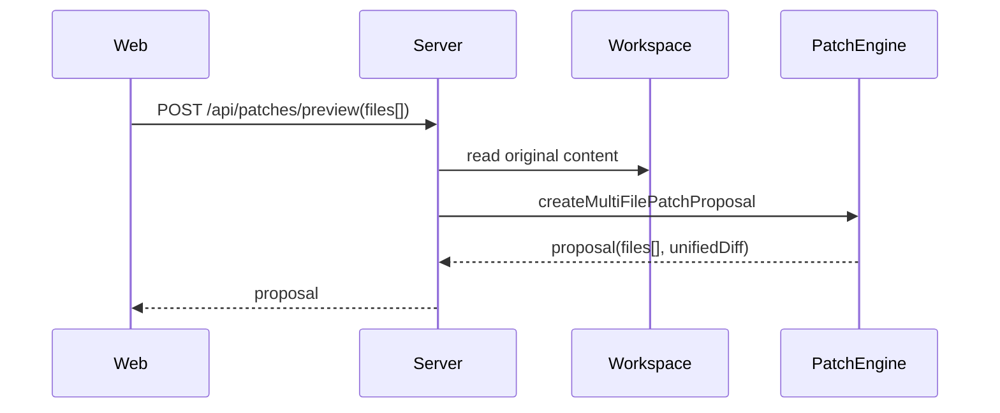

# Product Phase 06 设计说明：Multi-file Patch & Git Output

P6 的设计目标是把单文件 Patch Proposal 扩展为多文件 Patch，但不破坏旧接口。
因此 `PatchProposal` 仍保留 `path`、`hunks`、`updatedContent` 等单文件字段，同时新增
`files[]` 保存逐文件变更。

## 合约

`PatchFileChange` 描述单个文件：

- `kind`：create、modify、delete、rename。
- `path` / `oldPath`：新路径和重命名前路径。
- `originalContent` / `updatedContent`：用于 Web Diff。
- `originalContentHash`：用于 apply 前 conflict 检测。
- `unifiedDiff`：该文件的 patch 文本。

`PatchProposal.unifiedDiff` 是所有文件 `unifiedDiff` 的拼接结果。Web 导出的
`.patch` 和 Review 面板使用同一份文本，避免 UI 与导出结果不一致。

## Preview 流程

如果请求只有 `path + updatedContent`，Server 仍走单文件兼容路径。

## Apply 流程

Apply 必须满足：

1. proposal 已批准。
2. proposal 状态是 `approved`。
3. 每个文件当前内容 hash 与 proposal 创建时一致。
4. 每个文件写入都经过现有 `beforeFileEdit` / `afterFileEdit` hook。

写入顺序按 `files[]` 顺序执行。支持：

- create：`createTextFile`。
- modify：`writeTextFile`。
- delete：`deleteEntry`。
- rename：`renameEntry`，如果有内容变化再写入新路径。

Apply 成功后返回 `gitDiff`，由 `WorkspaceService.gitDiff()` 调用 `git diff --binary`
生成。

## Web UI

Review tab 增加三层信息：

1. commit message 草稿和 patch 下载按钮。
2. proposal 队列。
3. 多文件列表和 Monaco Diff。

编辑器工具栏增加 `Review All`，把当前打开且 dirty 的文件合并成一个多文件 proposal。

## 边界

- P6 不自动创建真实 Git commit。
- P6 不自动创建 GitHub PR。
- P6 不实现复杂 merge，只在 apply 前做基线 hash 冲突检测。
- P6 不处理二进制文件的可视化 diff。
