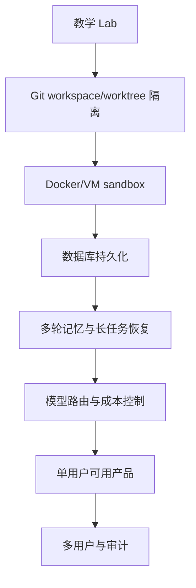

# 第 19 章：从教学 Lab 到工程产品

## 本章目标

本章不再新增 Agent Loop 能力，而是把前 18 个阶段收束成工程化路线。

你会完成：

1. 清理历史原型目录。
2. 审计当前仓库结构。
3. 总结 memory、tools、context、skills 的现状。
4. 判断离真实用户可用还有哪些差距。
5. 写一份让下一个会话能接手的交接文档。

## 为什么需要工程化路线

Coding Agent 教学项目容易出现一种问题：每个阶段都能跑，但最后不知道哪些能力是 demo，哪些能力已经接近产品。

Phase 19 的作用是停下来做工程判断：

- 哪些目录已经过时？
- 哪些模块只是教学级最小实现？
- 哪些安全边界还不能支撑真实用户？
- 下一轮开发应该从哪里开始？

## 本章清理什么

本章删除了两个历史包：

```text
packages/agent
packages/db
```

`packages/agent` 是早期一体化原型，和现在的分包架构重复。

`packages/db` 是早期 SQLite 原型，当前主线使用 `packages/telemetry` 的 `SessionStore`。

同时移除：

- `apps/server/package.json` 中对 `@wac/agent` 和 `@wac/db` 的依赖。
- root `package.json` 中无效的 `db:push` 脚本。

## 本章保留什么

`data/` 和 `workspaces/` 不删除为源码变更，因为它们是运行时目录，并已被 `.gitignore` 忽略。

```text
data/session-log.json
data/*.db*
workspaces/
```

如果你需要重置本地运行状态，可以本地删除它们；但不要把这些文件提交进仓库。

## 工程化路线图



这张图表达的是优先级：先保护用户 workspace，再保护执行环境，然后再谈多用户、插件和 MCP。

## Runtime 能力复盘

短期记忆：

- 当前 run 的 messages 和 tool observations 已经存在。
- Context Engine 会压缩最近 observation。
- 还缺 conversation summary 和恢复逻辑。

长期记忆：

- Session log 已经持久化。
- Trace 可以复盘。
- 还缺可检索 memory、数据库索引和跨 session recall。

工具管理：

- ToolRegistry、schema validation、permission、hooks 已经存在。
- 还缺工具版本、动态权限、MCP 工具源和完整 schema validator。

上下文管理：

- Repo map、diagnostics、relevant files、budget 已经存在。
- 还缺代码片段选择、symbol index、git diff 和 token 级预算。

Skill 加载：

- 本地 `.skills` 加载、trigger scoring、`agent.skill_selected` 已经存在。
- 还缺多 skill 合并、版本、权限声明和资源引用。

## 离真实用户可用还差什么

最关键的差距不是模型，而是工程边界：

1. 用户代码必须在独立 worktree/branch 中运行。
2. shell 命令必须进入强 sandbox。
3. patch 必须支持多文件、冲突和局部接受。
4. session 必须可恢复，而不是只记录事件。
5. Web IDE 必须支持真正编辑、diff 高亮和大日志分页。
6. 成本、权限、审计必须可查询。

## 验证

运行：

```bash
npm install
npm run typecheck
npm run build
```

可选 smoke：

```bash
PORT=8787 MODEL_PROVIDER=mock npm start
curl --noproxy '*' http://127.0.0.1:8787/api/health
```

返回的 phase 应为：

```text
phase-19-engineering-route
```

## 本章产物

- `docs/engineering/repository-audit.md`
- `docs/engineering/runtime-capability-review.md`
- `docs/engineering/product-readiness-gap.md`
- `docs/HANDOFF.md`

这些文档不是附属品，而是下一轮工程化开发的入口。

## 小结

Phase 19 的重点是清理和判断。一个 Coding Agent 项目能跑起来只是第一步，能被用户信任地使用，需要 workspace 隔离、强沙箱、持久状态、审计、成本控制和可恢复长任务。
